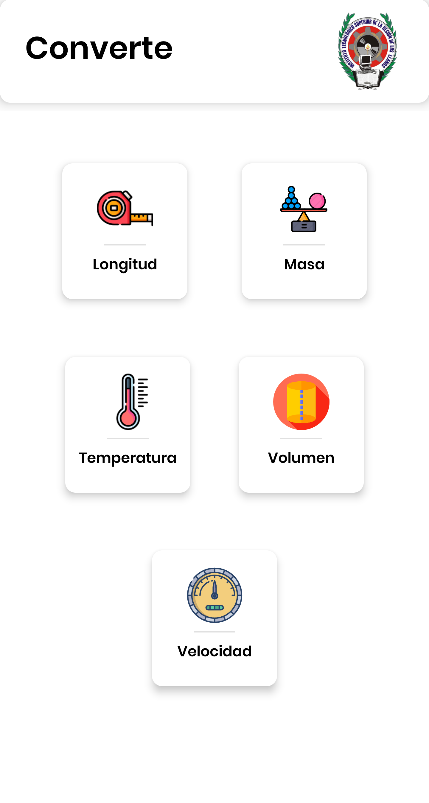
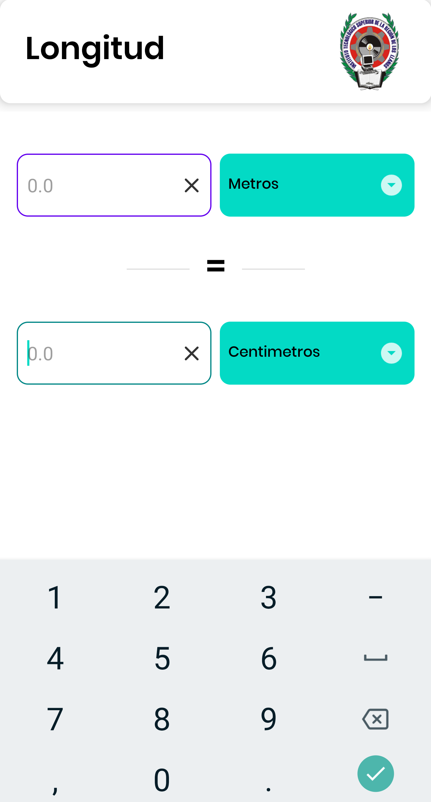

<!-- PROJECT LOGO -->
 

  

  <h3 align="center">Converte</h3>

  

    Aplicacion conversor de unidades
     
    <a href="https://github.com/VicentCode/Converte"><strong></strong></a>
     
     
    <a href="https://drive.google.com/uc?id=1jIveYzzUf9p7RcnUSNgReVrWxTSlKa0O&export=download">Descargar APK</a>
    ·
    <a href="https://github.com/VicentCode/Converte/issues">Reportar Bug</a>

    
  

<!-- ABOUT THE PROJECT -->
## Sobre el proyecto 

Converte es aplicación que permite convertir unidades básicas de: Temperatura, velocidad, volumen, masa y longitud. Converte forma parte de un proyecto escolar. Compatible para Android 5.0 o superior.

Aplicación diseñada y programada enteramente por Vicente Nevarez (VicentCode). Cualquier uso comercial o personal deberá ser informado al autor.

### Construida en:

* Android Studio
* Java

### Prerrequisitos

* Android 5.0 o superior.
* Desacativar modo oscuro.
  
### Instalacion

1. Descargar e instalar el APK
   
2. Aceptar instalación de origen desconocidos en caso de ser necesario.

<!-- ROADMAP -->
## Issues

Consulte [open issues](https://github.com/VicentCode/Converte/issues) para obtener una lista de funciones propuestas (y problemas conocidos).

<!-- CONTACT -->
## Contacto

VicentCode - [@twitter_VincentCode](https://twitter.com/vlcentcode) - email

Project Link: [https://github.com/VicentCode/Converte](https://github.com/VicentCode/Converte)

<!-- ACKNOWLEDGEMENTS -->
## Agradecimientos

* [Google](https://github.com/google)

<!-- MARKDOWN LINKS & IMAGES -->
<!-- https://www.markdownguide.org/basic-syntax/#reference-style-links -->
[contributors-shield]: https://img.shields.io/github/contributors/github_username/repo.svg?style=for-the-badge
[contributors-url]: https://github.com/github_username/repo/graphs/contributors
[forks-shield]: https://img.shields.io/github/forks/github_username/repo.svg?style=for-the-badge
[forks-url]: https://github.com/github_username/repo/network/members
[stars-shield]: https://img.shields.io/github/stars/github_username/repo.svg?style=for-the-badge
[stars-url]: https://github.com/github_username/repo/stargazers
[issues-shield]: https://img.shields.io/github/issues/github_username/repo.svg?style=for-the-badge
[issues-url]: https://github.com/github_username/repo/issues
[license-shield]: https://img.shields.io/github/license/github_username/repo.svg?style=for-the-badge
[license-url]: https://github.com/github_username/repo/blob/master/LICENSE.txt
[linkedin-shield]: https://img.shields.io/badge/-LinkedIn-black.svg?style=for-the-badge&logo=linkedin&colorB=555
[linkedin-url]: https://linkedin.com/in/github_username
